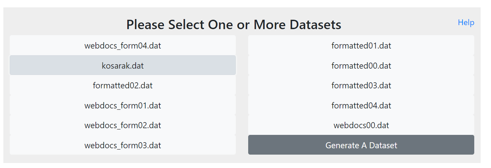
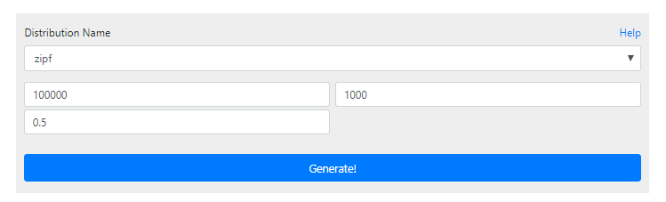
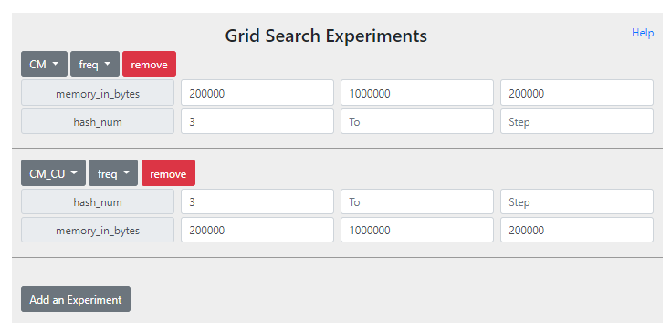
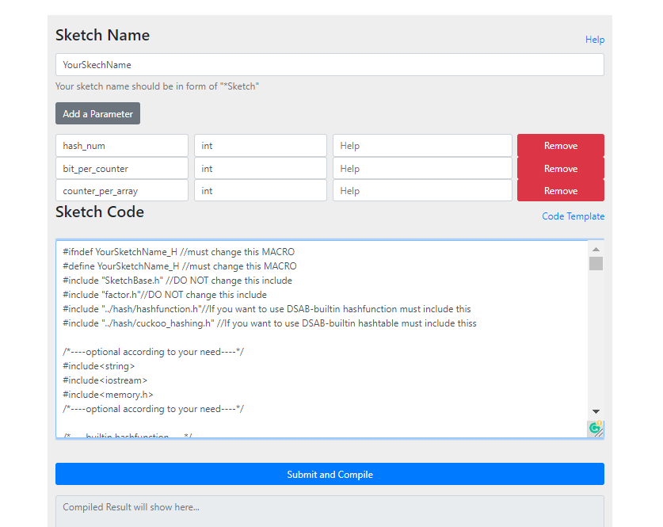
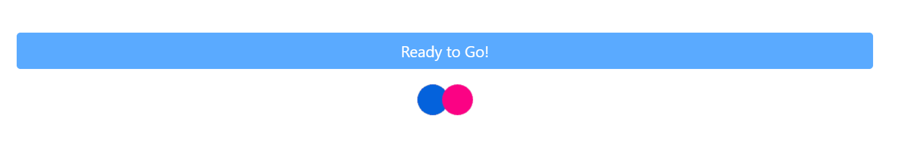
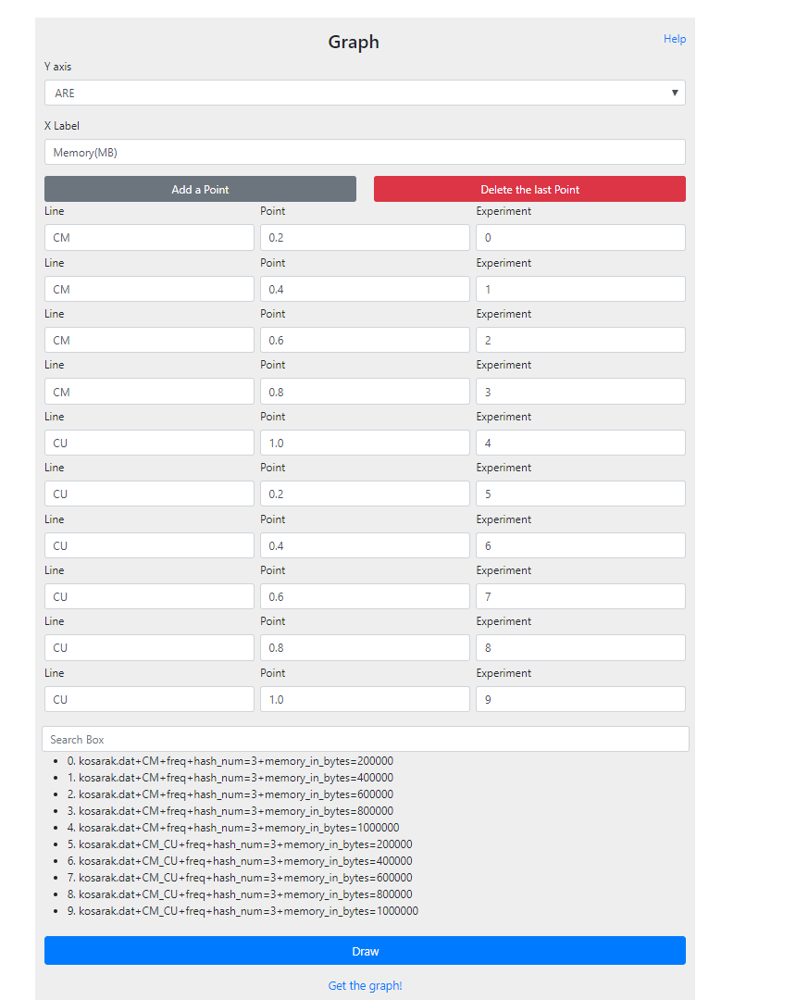
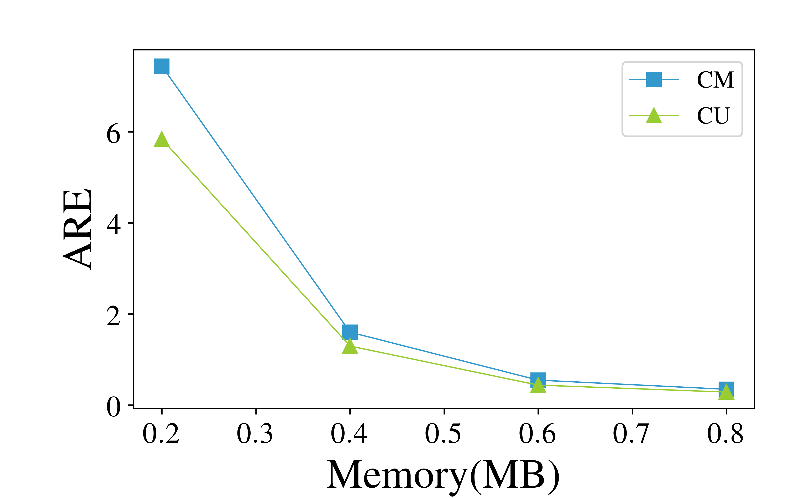

# Data Stream Algorithm Benchmark
A benchmark intended for testing the performance of various data stream algorithms for multiple datasets in a simple way.

## Requirements

- Both python2(>=2.7) and python3(>=3.5) are required.
- For python2, matplotlib and future packages are needed:
	- `pip2 install matplotlib==2 future`
- [Latex](https://www.latex-project.org/get/) 
- [MongoDB](https://www.mongodb.com/download-center/community) 

## How to build

First, you need to clone this repo, and install the python3 dependencies.
```bash
git clone https://github.com/Yuol96/pku-sketch-benchmark
cd pku-sketch-benchmark
pip3 install -r requirements.txt
```
Then, download the default datasets.
```bash
sh download.sh
```

## How to start


For the first time, you need to run `env.sh` to set up some environmental variables. Then, initiate the database.
```bash
source env.sh
flask init-db
```

To start the system, run the following command:
```bash
sh run.sh
```

Now, you can type in `<your-ip-address>:8086/skbm/index.html` in your web browser to access the benchmark interface.

## How to use

To make it more convenient and easier to use, we have built up a website for datastreams algorithms benchmarking. When you visit the home page, there are several modules to configure before running experiments and drawing graphs.

#### Select datasets

The first module is the dataset module. You need to choose one or more network datasets, and the selected datasets would be fed to each experiments of different parameter settings respectively. When you hover over a dataset button, the info about this dataset would pop out. Once you clicked the dataset, the corresponding button would turn to grey.

 

#### Generate new datasets

Though there are some existing datasets available, you can click the button at the bottom of this module to generate your own dataset. In the dataset generating page, you need to choose a distribution and fill out the form and submit the request to generate a dataset. Once you have done, you can go back to the home page and the generated dataset should be shown in the first module. 

 

#### Experiments setup

The main function of the benchmark lies in the second module, where you can perform grid search experiments over multiple parameters. Here we assume an experiment is defined by a particular sketch combined with a specific task. Within each experiment setup, you should first choose a sketch and a task, and then the corresponding parameters would have shown below. Each row defines a value range of a parameter. If you only need a single value for a parameter, you can only fill out the “from” box and leave the other two alone. If you want to perform multiple experiments, click the button at the bottom of this module. 

 

#### Add new sketch algorithms

To test your own sketch algorithm, you can upload your own sketch code by clicking the last item of the sketch dropdown button. When redirecting to the new page and uploading your code, you need to provide the name of your sketch algorithm. It is recommended to use "xxxSketch" pattern. The name should be different from all the existing sketch algorithms in this benchmark, or the original sketch with the same name would be overwriten. Then, specify all the hyperparameters that should be defined before experimenting your algorithms. Finally, copy and paste your code in the code box and submit and compile your code. Notice that you may fail to compile the code. When this happens, your code won't be recorded and you need to check your code. Sometimes you want to change your algorithm after having submission and compilation. By simply submitting your updated code with the same sketch name can overwrite the original version of code. When you finished, click the navigation icon at the top of the page to go back to the main page.

 

#### Run the experiments

After configuring the first two modules, click `ready to go` to start running experiments at the back ends. This may take some time, depending on your configuration. 

 

#### The Graph module

The experimental results will send back to the front end, and the user can visualize the results by using **Graph** module. This module requires specific configuration for each point. Y axis in the second module is the same as the first module. X label is the name of x axis in the graph. For each point, you need to specify which line it belongs to, the position of the point in the x axis, and the index of the experiment that you want to draw value from. All the experiemnts are shown below the search box, and you can search particular experiment by typing keywords. 

 

#### Sample result

When you finish configuring the graph module, click the `draw` button, and the figure would be generated in the backend. You can click `Get the Graph!` to see the figure, or you can also share the link with others. 

 


